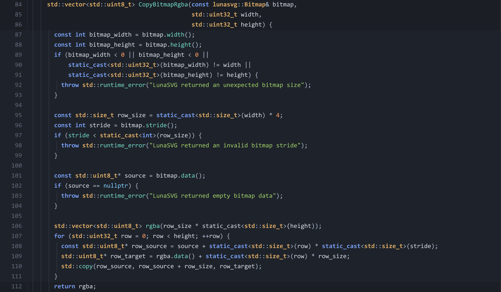

简体中文 | [English](./README.md)

# SweetShot

SweetShot 是一个代码截图生成器。

语法高亮和主题走 SweetLine，输出支持 SVG、PNG 和 HTML。README、文档、博客、发布说明里要放代码图时，可以直接用 CLI 生成；需要集成到应用里，也可以接 C++ core。

## 支持什么

- SVG、PNG、HTML 输出
- 内置主题
- 行号和指定行范围渲染
- focus / mark 行，用来强调代码片段
- indent guides，截图里也能看出代码块层级
- PNG 后端可选 `resvg` 或 `lunasvg`

## 示例

```bash
build/bin/sweetshot src/lunasvg_rasterizer.cpp --lines 84:112 --focus 87:111 -o docs/images/readme-indent-guides.png
```



## 构建

需要 CMake 和 C++17 编译器。默认 PNG 后端是 `resvg`，所以默认构建还需要 Rust/Cargo。

```bash
cmake -S . -B build
cmake --build build
ctest --test-dir build --output-on-failure
```

构建时会通过 CMake FetchContent 从 `https://github.com/FinalScave/SweetLine.git` 拉取 SweetLine，并固定到 `f8aa883b50f2e748098420917fbef5865b55a861`。

需要明确选择 PNG 渲染后端时，可以设置 `SWEETSHOT_PNG_BACKEND`：

```bash
cmake -S . -B build -DSWEETSHOT_PNG_BACKEND=resvg
cmake -S . -B build-lunasvg -DSWEETSHOT_PNG_BACKEND=lunasvg
```

## CLI

CLI 会根据输出文件扩展名决定格式。

```bash
build/bin/sweetshot main.cpp -o main.svg
build/bin/sweetshot main.cpp -o main.png
build/bin/sweetshot main.cpp -o main.png --scale 1
build/bin/sweetshot main.cpp --theme default --lines 20:60 --focus 32:38 -o part.svg
cat main.cpp | build/bin/sweetshot --lang cpp -o stdin.html
```

PNG 输出使用配置的后端。默认以 3x scale 渲染，正常使用时文字会更清晰。

常用参数：

- `--scale <factor>` 设置 PNG 输出缩放倍数，默认是 `3`。
- `--theme <name>` 选择内置主题。
- `--lines <start:end>` 渲染一段从 1 开始计数的闭区间行范围。
- `--focus <range-list>` 高亮从 1 开始计数的行。
- `--mark <range-list>` 标记从 1 开始计数的行。
- `--no-line-numbers` 隐藏行号。
- `--no-indent-guides` 隐藏缩进辅助线。
- `--syntax-dir <path>` 覆盖 SweetLine 语法目录。
